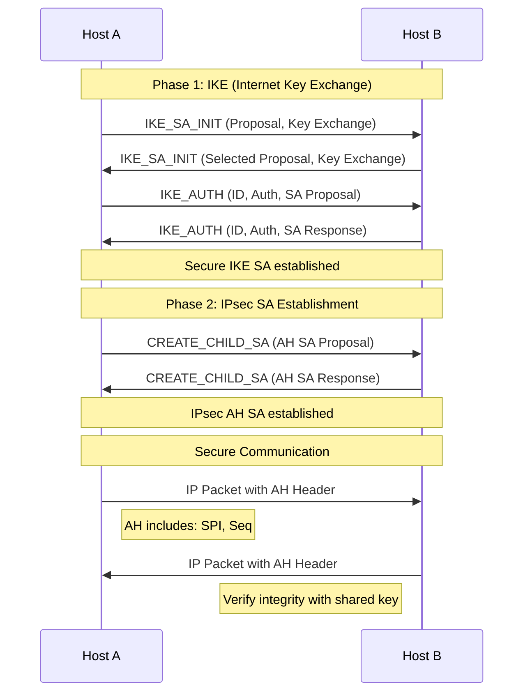
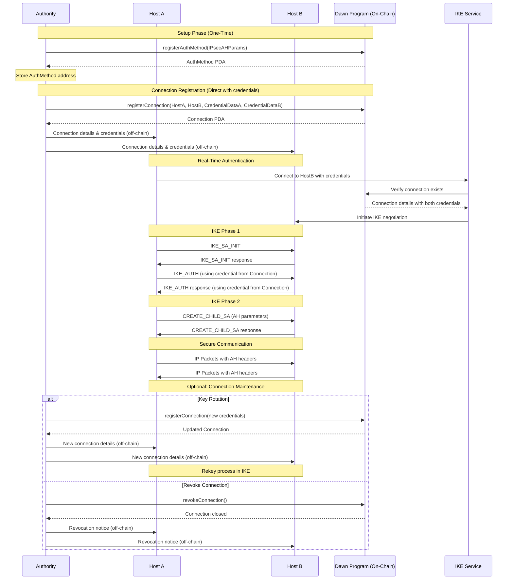
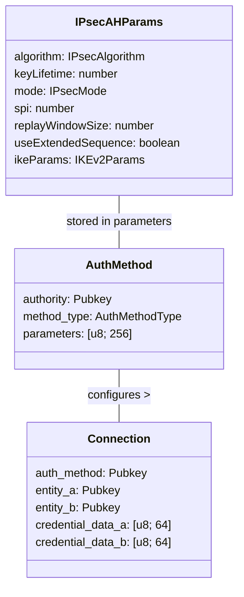

# IPsec Authentication Header (AH) for Dawn AMF

This module implements IPsec Authentication Header (AH) for Dawn's Authentication Method Framework (AMF).

## Overview

IPsec AH is a protocol that provides data origin authentication, data integrity, and anti-replay protection at the IP layer (Layer 3). Unlike other IPsec protocols like ESP, AH does not provide confidentiality (encryption) of the payload.

Our implementation focuses on modern hash algorithms like HMAC-SHA256 and supports both transport and tunnel modes.

## Key Components

The IPsec AH implementation involves several components:

1. **Host A**: The initiator of the secure connection
2. **Host B**: The responder to the connection request
3. **IKE (Internet Key Exchange)**: Protocol for establishing Security Associations (SAs)
4. **Security Association (SA)**: Collection of security parameters for a secure connection

## Supported Algorithms

Our implementation supports the following authentication algorithms:

- **HMAC_SHA256_128** (2): Modern, secure hash algorithm (recommended)
- **HMAC_SHA384_192** (3): Higher security hash algorithm
- **HMAC_SHA512_256** (4): Maximum security hash algorithm
- **AES_XCBC_96** (5): Alternative for constrained environments
- **BLAKE2s_128** (8): High-performance modern algorithm

Legacy algorithms (HMAC_MD5_96, HMAC_SHA1_96) are supported but not recommended for new deployments.

## Parameters

The `IPsecAHParams` structure contains the following fields:

- `algorithm`: Authentication algorithm to use
- `keyLifetime`: Key lifetime in seconds
- `mode`: Transport or Tunnel mode
- `spi`: Security Parameter Index
- `replayWindowSize`: Anti-replay window size
- `useExtendedSequence`: Whether to use 64-bit extended sequence numbers
- `ikeParams`: IKEv2 parameters for key exchange

## Authentication Process

IPsec AH establishes secure communications through a two-phase process:

## IPsec AH Flow

## Complete Authentication Flow with Dawn AMF

The following diagram shows the complete flow including on-chain transactions and off-chain components:

## On-Chain Implementation

Our Dawn AMF implementation stores IPsec parameters and credentials directly in the Connection account, which is more appropriate for two-way authentication protocols like IPsec AH:

## Two-Way vs One-Way Authentication

Unlike 802.1X which uses one-way authentication (client authenticating to network), IPsec AH requires mutual authentication between both entities. This is why our implementation:

- Stores credentials for both entities directly in the Connection account
- Does not require separate Credential accounts for each entity

This approach simplifies the authentication flow and better matches the IPsec protocol model where both parties need access to each other's authentication information.

## Security Considerations

Our implementation prioritizes security through:

- Support for modern, secure hash algorithms
- Anti-replay protection with configurable window size
- Extended sequence numbers for high-volume connections
- IKEv2 for secure key exchange
- Regular key rotation via configurable key lifetimes
- Perfect Forward Secrecy through Diffie-Hellman key exchange

## Usage

To register an IPsec AH authentication method and connection for a Dawn network:

1. Create an `IPsecAHParams` instance with appropriate settings
2. Register the authentication method using `registerAuthMethod`
3. Generate credential data for each entity using `generateIPsecAHCredential`
4. Register a connection with both credentials using `registerConnection`

See the test file (`tests/dawn/09_amf.ts`) for a complete example of registering an IPsec AH authentication method and establishing a connection.