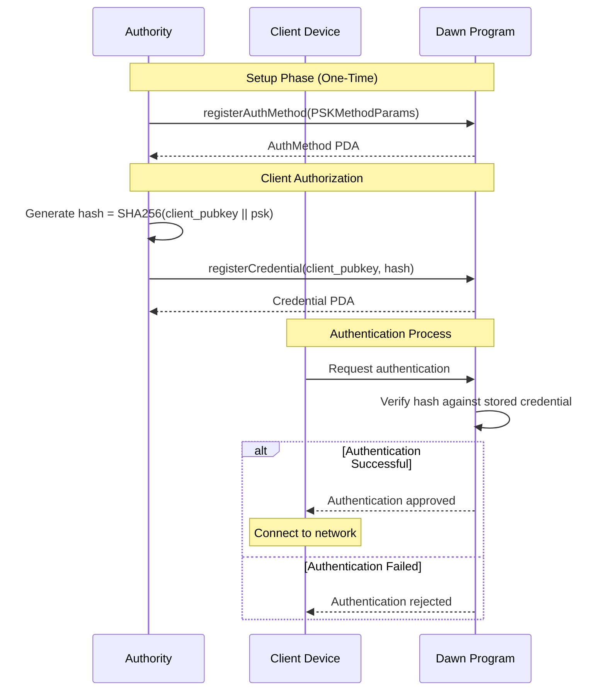
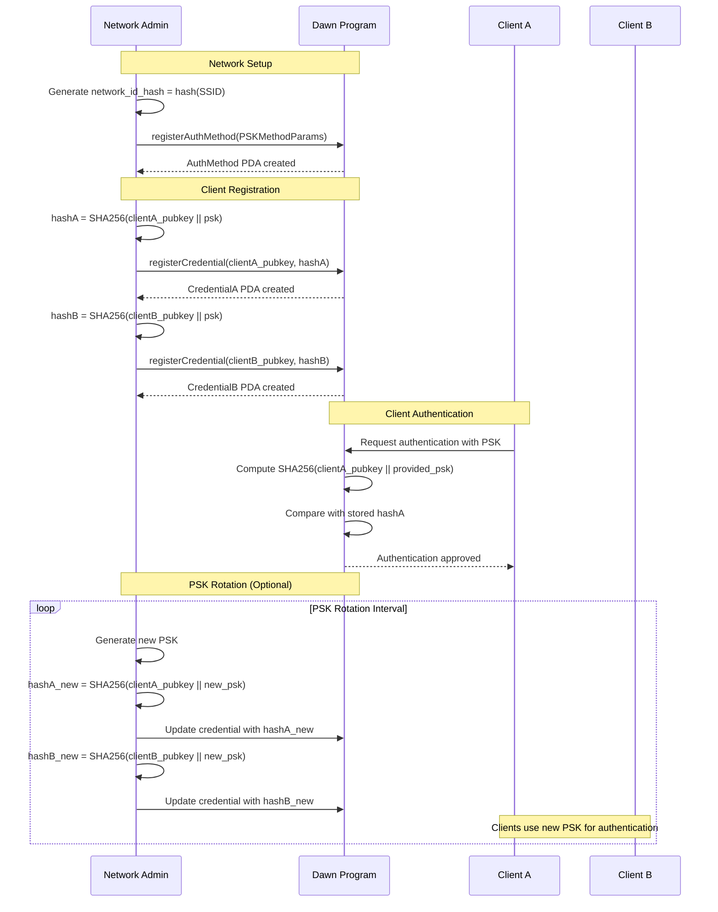
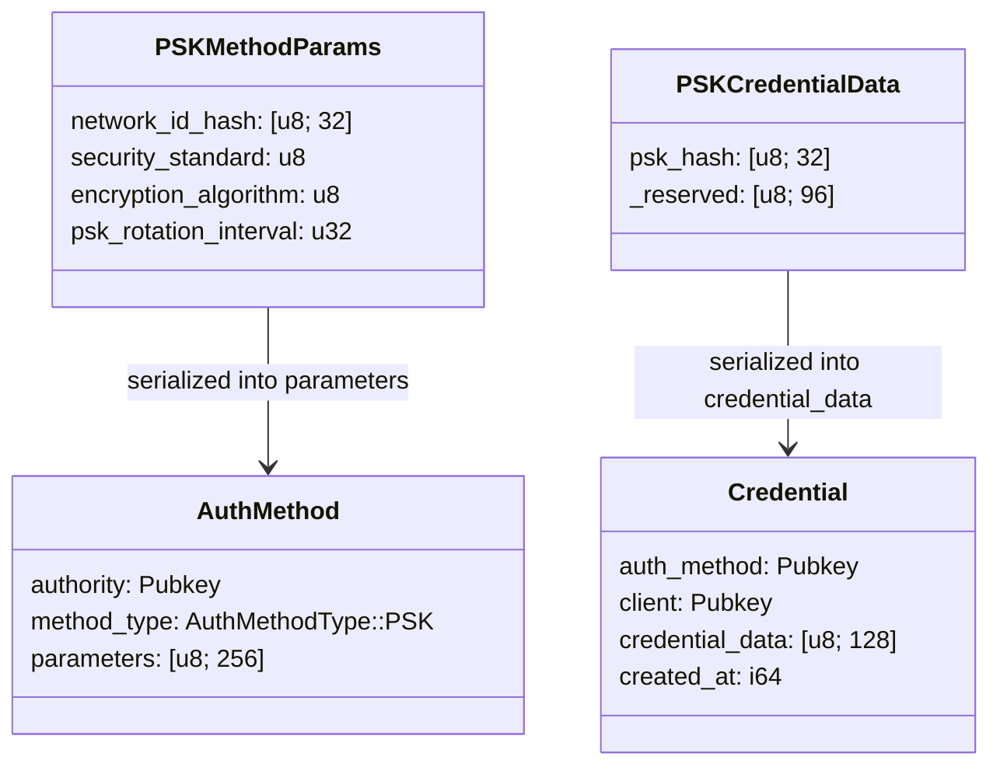

# PSK (Pre-Shared Key) Authentication for Dawn AMF

This module implements PSK (Pre-Shared Key) authentication for Dawn's Authentication Method Framework (AMF).

## Overview

PSK authentication is a simple, widely-used WiFi authentication method where all authorized devices share the same password (pre-shared key). It's commonly used in home networks, small businesses, and guest networks due to its simplicity and ease of setup.

Our implementation focuses on maintaining security while keeping sensitive information (SSID and PSK) off-chain, storing only network configuration parameters on-chain. Client credentials use the client's public key as salt for space-efficient and secure hash storage.

## Key Components

The PSK authentication system involves:

1. **Network Authority**: Manages the WiFi network and authentication parameters
2. **Access Point**: The WiFi router/access point that controls network access
3. **Client Device**: Device seeking to connect to the WiFi network
4. **Dawn AMF**: On-chain storage of network parameters and off-chain credential management

## Supported Security Standards

Our implementation supports modern WiFi security standards:

- **WPA2-PSK** (0): Widely supported legacy standard using AES-CCMP
- **WPA3-PSK** (1): Modern standard with improved security using AES-GCMP

## Supported Encryption Algorithms

- **AES-CCMP** (0): Counter Mode with CBC-MAC Protocol (WPA2)
- **AES-GCMP** (1): Galois/Counter Mode Protocol (WPA3)
- **AES-GCMP-256** (2): Enhanced security with 256-bit keys (WPA3)

## Parameters

The `PSKMethodParams` structure contains the following on-chain parameters:

### Security Parameters
- `network_id_hash`: Hash of the network SSID for identification (32 bytes)
- `security_standard`: WiFi security standard (WPA2/WPA3)
- `encryption_algorithm`: Encryption algorithm used

### Network Configuration
- `psk_rotation_interval`: How often PSK should be rotated (0 = no rotation)

## Authentication Process

The PSK authentication process follows these steps:



## Security Model

### On-Chain Security
- Network identifier is hashed to prevent SSID enumeration
- Client credentials stored as hash using client pubkey as salt
- Only network configuration parameters stored on-chain
- No sensitive PSK or SSID data stored on-chain

### Client Credential Security
- Each client has individual credential account
- Hash computed as SHA-256(client_pubkey || psk)
- Client pubkey provides unique salt per client
- Space-efficient: only 32-byte hash stored per client

## Complete Registration Flow

The following diagram shows the complete flow including on-chain registration and off-chain credential distribution:



## Implementation Details

### On-Chain Storage
Our Dawn AMF implementation stores network configuration parameters on-chain while keeping sensitive data off-chain:



### Credential Management
Our approach combines on-chain and off-chain elements:

**On-Chain Storage:**
- **Network ID Hash**: SHA-256 hash of SSID for network identification
- **Client Credentials**: Individual credential accounts per client
- **PSK Hash**: SHA-256(client_pubkey || psk) stored per client
- **Network Parameters**: Security standard, encryption, rotation interval

**Off-Chain Distribution:**
- **SSID**: Network name provided to authorized clients
- **PSK**: Pre-shared key distributed through secure channels
- **Client Registration**: Authority registers client pubkeys with computed hashes

## Security Considerations

### Advantages
- **Individual Accountability**: Each client has unique credential account
- **Space Efficient**: Only 32-byte hash stored per client (vs 64 bytes with separate salt)
- **Secure Salt**: Client pubkey provides unique, deterministic salt
- **Easy Revocation**: Individual client credentials can be revoked
- **Cost Effective**: Reduced on-chain storage costs

### Security Measures
- **WPA3 Support**: Enhanced security with modern encryption standards
- **Client Pubkey Salt**: Unique salt per client prevents rainbow table attacks
- **Individual Credentials**: Each client registered separately with unique hash
- **PSK Rotation**: Network-wide PSK rotation with individual hash updates
- **No Sensitive Data On-Chain**: PSK and SSID never stored on-chain

### Considerations
- **PSK Distribution**: Network PSK still shared among authorized clients
- **Hash Computation**: Requires client pubkey for verification
- **Network-Wide Changes**: PSK rotation affects all clients simultaneously

## Usage Examples

### Basic PSK Network
```rust
// Create basic PSK parameters
let network_id_hash = hash("MyHomeNetwork".as_bytes());
let params = PSKMethodParams {
    network_id_hash,
    security_standard: WiFiSecurityStandard::WPA3_PSK,
    encryption_algorithm: WiFiEncryption::AES_GCMP,
    psk_rotation_interval: 86400, // 24 hour rotation
};
```

### Secure Corporate Network
```rust
// Create secure PSK parameters for corporate use
let network_id_hash = hash("CorpGuest".as_bytes());
let params = PSKMethodParams {
    network_id_hash,
    security_standard: WiFiSecurityStandard::WPA3_PSK,
    encryption_algorithm: WiFiEncryption::AES_GCMP_256,
    psk_rotation_interval: 3600, // 1-hour PSK rotation
};
```

### Guest Network (Legacy Compatibility)
```rust
// Create guest network parameters with legacy support
let network_id_hash = hash("GuestWiFi".as_bytes());
let params = PSKMethodParams {
    network_id_hash,
    security_standard: WiFiSecurityStandard::WPA2_PSK,
    encryption_algorithm: WiFiEncryption::AES_CCMP,
    psk_rotation_interval: 0, // no rotation for guest network
};
```

### Client Registration Example
```typescript
// Register individual client credentials
const psk = "SuperSecurePassword123!";
const clientPubkey = new PublicKey("...");

// Authority computes hash using client pubkey as salt
const credentialData = createPskCredentialData(psk, clientPubkey);
const serializedData = serializePskCredentialData(credentialData);

// Register credential on-chain
await program.methods
  .registerCredential(clientPubkey, Array.from(serializedData))
  .accounts({
    caller: authority.publicKey,
    authMethod: authMethodPda,
    credential: credentialPda,
  })
  .rpc();
```