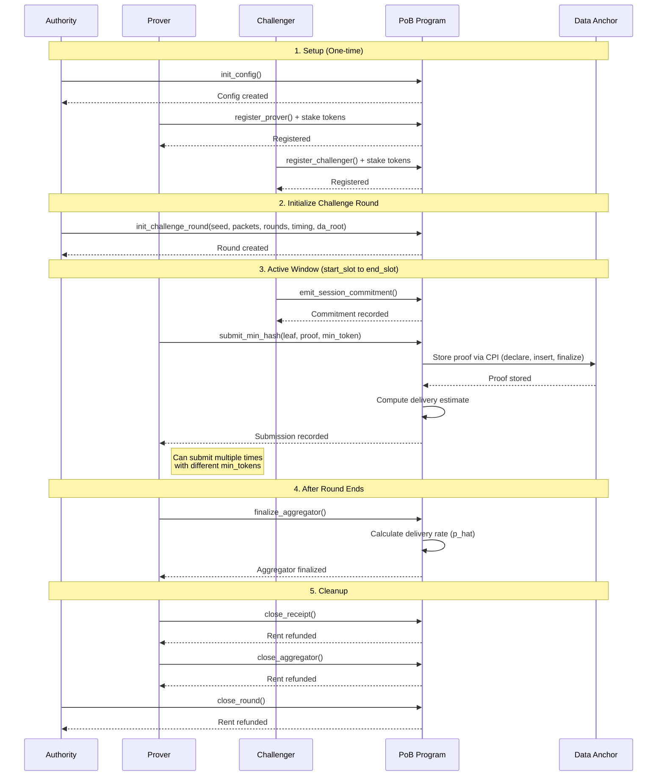

# Proof of Bandwidth (PoB) Program

A standalone Solana program for decentralized bandwidth verification using min-hash statistical testing.

## Overview

The PoB program implements a cryptographic bandwidth verification protocol where:
- **Provers** claim to provide specific bandwidth
- **Challengers** test these claims by sending packets
- **Aggregators** collect min-hash statistics to estimate delivery rates
- **Data Anchor** stores off-chain proofs and commitments

## Protocol Flow



## Key Components

### Main Accounts (PDAs)

| Account | Purpose |
|---------|---------|
| **Config** | Protocol configuration (stake amounts, cooldowns) |
| **Prover** | Prover registration + reputation + stake vault |
| **Challenger** | Challenger registration + reputation + stake vault |
| **Round** | Challenge round with timing and DA merkle root |
| **Aggregator** | Accumulates min-hash submissions per prover |
| **Receipt** | Replay protection (one per min_token) |

### Core Instructions

1. **Setup**: `init_config`, `register_prover`, `register_challenger`
2. **Round Lifecycle**: `init_challenge_round`, `close_round`
3. **Active Window**: `emit_session_commitment`, `submit_min_hash`
4. **Finalization**: `finalize_aggregator`, `close_receipt`, `close_aggregator`
5. **Unstaking**: `request_unstake_*`, `complete_unstake_*`

### Key Operations

**Delivery Rate Calculation**:
- `score = hash(round.seed, min_token)`
- `n_est = (1 - m) / m` where `m = score / u128::MAX`
- `p_hat = (n_packets * n_rounds) / sum(n_est)` (capped at 1.0)

**Data Anchor Integration**:
- Stores immutable proof via CPI: `declare_blob` → `insert_chunk` → `finalize_blob`
- Payload: `version || round_id || prover_authority || min_token`

**Replay Protection**:
- Each submission creates unique Receipt PDA: `[round, prover, min_token]`
- Duplicate `min_token` fails with "account already in use"

### Timing Constraints

- **Active Window**: `start_slot` to `end_slot`
- **Submission**: Must be within active window
- **Finalization**: Must be after `end_slot`
- **Round Closure**: Must be after `end_slot + grace_period` (5000 slots)

## Example with Simulated Data

### Configuration
```
Config:
  - prover_stake_amount: 10,000 tokens (10,000,000,000 with 6 decimals)
  - challenger_stake_amount: 1,000 tokens (1,000,000,000 with 6 decimals)
  - unstake_cooldown_slots: 1,512,000 (~7 days)
  - round_close_grace_slots: 5,000
```

### Challenge Round Setup
```
Round ID: 0x3a7f...8b2c (random 32-byte seed)
Parameters:
  - n_packets: 100 packets
  - n_rounds: 10 rounds
  - start_slot: 1,000,000
  - end_slot: 1,100,000 (100,000 slot window ~12 hours)
  - data_anchor_root: 0x9f2e...4a1b (merkle root from DA)
```

### Participants
```
Prover Authority: D4wN...xY9z
Prover PDA: PRoV...aB3c
Staked: 10,000 tokens
Reputation: 1000

Challenger Authority: CH4L...mN7p
Challenger PDA: ChaL...eF8d
Staked: 1,000 tokens
Reputation: 1000
```

### Min-Hash Submissions

**Submission #1 (Slot 1,000,150)**:
```
Min Token: 0x1234...5678
Computed Values:
  - score: 0x0000...0123456789abcdef (very low = high estimate)
  - n_est_scaled: 809,999,988,889,000 (~810 billion)

Aggregator: num_submissions=1, sum_n_est_scaled=809,999,988,889,000
```

**Submission #2 (Slot 1,025,000)**:
```
Min Token: 0xabcd...ef00 (different from #1)
Computed Values:
  - score: 0xffff...edcba9876543 (very high = low estimate)
  - n_est_scaled: 1,000,001,112 (~1 billion)

Aggregator: num_submissions=2, sum_n_est_scaled=810,000,989,001,112
```

### Finalization (Slot 1,100,010)
```
Delivery Rate Calculation:
  - total_expected = n_packets * n_rounds = 100 * 10 = 1,000
  - sum_n_est = 810,000,989,001,112 / 10^12 ≈ 810,000.989
  - p_hat = 1,000 / 810,000.989 ≈ 0.001234 (0.1234%)

Result: p_hat = 0.12% indicates poor network performance (99.88% packet loss)
```

## Building

```bash
anchor build --program-name pob
```

## Testing

```bash
yarn test tests/pob/pob.test.ts
```

## Security Features

- Slot-based timing validation
- Authority verification on all operations
- Cryptographically secure score calculation using seed
- Receipt-based replay prevention
- Checked arithmetic for overflow protection

## Documentation

### Related Documentation
- `PoB v2 Orchestrator.md` - Full architecture and orchestration
- `pob-accounts.md` - Detailed account structure
- `POB_TEST_STATUS.md` - Test coverage and status

### Test Suite
- `tests/pob/10_pob.ts` - Core functionality tests
- `tests/pob/11_error_cases.ts` - Error validation tests
- `tests/pob/12_integration.ts` - Full integration flow with DA
- `tests/pob/13_unstaking.ts` - Unstaking lifecycle tests
- `tests/pob/14_unstaking_errors.ts` - Unstaking error cases
- `tests/pob/15_unstaking_participation.ts` - Unstaking participation constraints

### SDK
- `sdk/pda/pob.ts` - PDA derivation functions
- `sdk/utils/pob.ts` - Utility functions, merkle proofs, DA helpers
